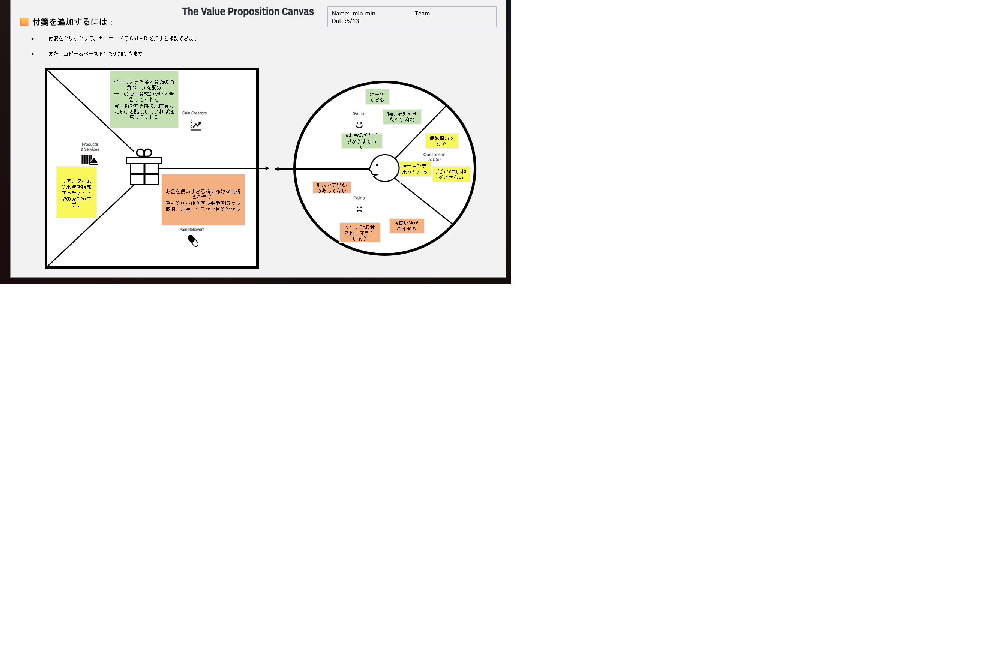

# VPC v1 - kimu_4056

> 「**自分や周りの人を顧客に設定**」したVPC。13週後の自分が欲しいもの・身近な人のために作りたいものを設計する。
> v1 でいい。完璧を目指さない。第6回でアップデート(v2)します。

---

## 1. 解決したい困りごとを 1つ 選ぶ

> [`bug-list.md`](./bug-list.md) の20個から、**「自分が一番これを解決したい!」と思うもの** を1つ選んでください。
> 1つに絞れなければ、複数候補を書いてOK(後で絞り込みます)。

**選んだ困りごと**:

[後ほどバグリストから選択して★を付けます]

---

## 2. その解決策のアイデアを書く

> 選んだ困りごとに対する「**こうだったらいいのに**」を1つ書く。
> 現実性は気にせず、自由に発想。

**解決のアイデア**:

リアルタイムでお金を通知するチャット型家計簿アプリ

---

## 3. VPC本体

> 上で選んだ「困りごと」と「解決のアイデア」を起点に、6要素を埋めていきます。

### 🟦 Customer Profile(顧客=自分自身)

#### Jobs(やりたいこと・動詞で書く)

- 無駄遣いを防ぐ
- 余計な物を買わない

#### Pains(困っていること)

- 収入と支出が見合っていない
- 買い物しすぎる
- ゲームでお金を使いすぎてしまう

#### Gains(得たい未来・状態)

- 計画ができる
- 物が溜まらなくて済む
- 一日でお金がわかる

---

### 🟧 Value Map(あなたが作るもの)

#### Products & Services

- リアルタイムでお金を通知するチャット型家計簿アプリ

#### Pain Relievers

- お金を使いすぎる前に通知や警告ができる
- 買ってから後悔する事前の支出を通知
- 貯金ペースが一目でわかる

#### Gain Creators

- 今月使えるお金と金額の消費ペースを配分
- 一日の使用金額が多いと警告してくれる
- 買い物をするときに以前買ったものと類似していれば注意してくれる

---

## 4. Fit確認(整合チェック)

| Pains/Gains | ↔ | Pain Relievers / Gain Creators | チェック |
|---|---|---|---|
| 買い物しすぎる / ゲームでの浪費 | ↔ | お金を使いすぎる前に通知や警告ができる | ✓ |
| 買ってから後悔する | ↔ | 事前の支出を通知 | ✓ |
| 収入と支出の不一致 | ↔ | 貯金ペースが一目でわかる | ✓ |
| 計画ができる | ↔ | 今月使えるお金と金額の消費ペースを配分 | ✓ |
| 一日でお金がわかる | ↔ | 一日の使用金額が多いと警告してくれる | ✓ |
| 物が溜まらなくて済む | ↔ | 類似商品の購入注意 | ✓ |

> 整合しないものは「自分が作りたいだけ」のプロダクトになりがち。
> 迷ったら AI大学講師に壁打ち。
